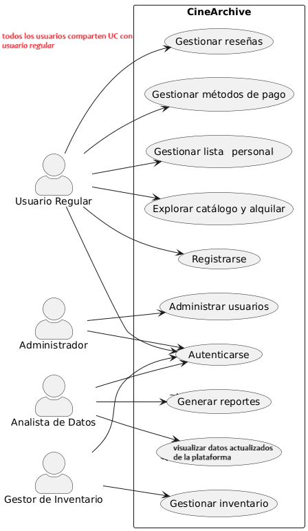

# CineArchive – Documentación Integral del Proyecto

## 1. Portada
- **Materia:** Programación II (2.603) – 2025
- **Docente:** Miguel Silva
- **Integrantes:** Francisco Chiminelli, Franco Vilaseco, Martín Zembo
- **Curso:** (Completar)
- **Proyecto:** CineArchive – Plataforma de alquiler y gestión de contenido audiovisual
- **Repositorio GitHub:** https://github.com/x-chama-x/CineArchive

## 2. Descripción General
### Tema elegido
Extensión del TP1: plataforma de streaming con alquiler temporal de películas y series.

### Objetivos
1. Gestionar autenticación multirol.  
2. Sostener catálogo con reservas/alquileres.  
3. Disponibilizar paneles independientes para administración, inventario y analítica.  
4. Integrar APIs externas para enriquecer metadatos y abastecer inventario.  
5. Documentar flujos de negocio, base de datos y casos de uso para defensa oral.

### Actores
| Actor | Rol | Responsabilidades |
|-------|-----|-------------------|
| Usuario Regular | Cliente final | Buscar/alquilar títulos, manejar listas, reseñar.
| Administrador | Supervisor | ABM usuarios, políticas y auditoría. **Puede realizar todas las acciones de Usuario Regular.**
| Gestor de Inventario | Operaciones | CRUD de contenido, licencias y categorías. **Puede realizar todas las acciones de Usuario Regular.**
| Analista de Datos | Business Intelligence | Generar reportes y dashboards. **Puede realizar todas las acciones de Usuario Regular.**

> **Nota importante:** Todos los roles especializados (Administrador, Gestor de Inventario, Analista de Datos) heredan las capacidades del Usuario Regular, pudiendo navegar el catálogo, alquilar contenido, gestionar listas personales y publicar reseñas, además de sus funciones administrativas específicas.

## 3. Arquitectura y Frameworks
### Capas
1. **Configuración (`backend/config`)**: Spring MVC + DataSource + interceptores.  
2. **Modelo (`backend/modelo`)**: Entidades JPA-lite con enums y validaciones.  
3. **Repositorio (`backend/repositorio`)**: Interfaces + implementaciones JDBC (Spring JDBC Template).  
4. **Servicio (`backend/servicio`)**: Lógica de negocio, orquestación, validaciones cruzadas, schedulers.  
5. **Controlador (`frontend/controlador`)**: Spring MVC controllers para rutas públicas y paneles JSP.  
6. **Vistas (`webapp/WEB-INF/views`)**: JSP con JSTL + fragmentos header/footer.  
7. **Recursos (`resources`)**: properties, scripts SQL, docs oficiales.

### Frameworks y librerías
- **Spring Web MVC 5.3.30** – DispatcherServlet, ViewResolver, controladores anotados.  
- **Spring Context / TX / JDBC** – DI, transacciones y acceso a datos.  
- **Hibernate Validator** – Validaciones bean-level.  
- **MySQL Connector/J** – Driver JDBC.  
- **Apache HttpClient + Gson** – Integración APIs externas TMDb/OMDb.  
- **BCrypt (jBCrypt)** – Hashing de contraseñas.  
- **JSTL** – Etiquetas en JSP.  
- **Jetty** – Servidor embebido.  
- **JUnit** – Tests (scope test).  

## 4. Estructura del Proyecto y Rutas Clave
```
CineArchive/
├── pom.xml
├── src/main/java/edu/utn/inspt/cinearchive/
│   ├── backend/
│   │   ├── config/
│   │   │   ├── AppConfig.java – @Configuration central.
│   │   │   ├── DatabaseConfig.java – DataSource + JdbcTemplate + properties.
│   │   │   ├── WebMvcConfig.java – ViewResolver, ResourceHandlers, message converters.
│   │   │   ├── SecurityInterceptor.java – HandlerInterceptor para verificar sesión/rol.
│   │   │   └── WebAppInitializer.java – reemplaza web.xml para inicializar Spring.
│   │   ├── modelo/
│   │   │   ├── Usuario.java – entidad multirol con enum Rol.
│   │   │   ├── Contenido.java – metadatos, disponibilidad, licencias.
│   │   │   ├── Alquiler.java / AlquilerDetalle.java – lifecycle de alquiler.
│   │   │   ├── Lista.java / ListaContenido.java – listas personales.
│   │   │   ├── Categoria.java / ContenidoCategoria / ContenidoCategoriaId – tagging.
│   │   │   ├── Resena.java – reseñas, calificaciones con @NotNull y @DecimalMin/Max.
│   │   │   ├── Reporte.java – resultados BI con tipos enumerados.
│   │   │   ├── MetodoPago.java – tarjetas, billeteras, alias.
│   │   │   └── Transaccion.java – pago vinculado a alquiler y método.
│   │   ├── repositorio/
│   │   │   ├── *Repository.java – contratos CRUD.
│   │   │   └── *RepositoryImpl.java – consultas SQL con RowMapper internos.
│   │   ├── servicio/
│   │   │   ├── UsuarioService.java – registro, login, perfiles, administración.
│   │   │   ├── ContenidoService.java – catálogo, filtros, integraciones.
│   │   │   ├── AlquilerService.java + AlquilerMaintenanceScheduler – gestión de alquileres y tareas programadas para expirar.
│   │   │   ├── ListaService.java – listas públicas/privadas.
│   │   │   ├── MetodoPagoService.java – ABM métodos.
│   │   │   ├── CategoriaService / ResenaService / ReporteService – lógica roles Gestor/Analista.
│   │   │   ├── ApiExternaService/Impl + HttpClientUtil – consumo TMDb/OMDb.
│   │   │   └── TransaccionService – pipeline de pagos.
│   │   └── util/
│   │       └── PasswordUtil.java – reglas de complejidad, verificación y rehash.
│   └── frontend/controlador/
│       ├── LoginController, RegistroController, SessionController – auth + sesiones.
│       ├── CatalogoController, DetalleContenidoController, ListaController, ParaVerController – flujo usuario regular.
│       ├── AdminUsuariosController, AdminPanelController – panel admin.
│       ├── GestorInventarioController, InventarioViewController, ContenidoController, CategoriaController – inventario.
│       ├── ReporteController, ReportesViewController, ApiIntegracionController – analítica/APIs.
│       ├── MetodoPagoController, AlquilerController, ResenaController – submódulos funcionales.
│       └── HealthController, HomeController – utilitarios.
├── src/main/resources/
│   ├── application.properties – propiedades BD y APIs externas.
│   ├── db/
│   │   ├── cineArchiveBD.sql – dump integral MySQL (tablas, datos seed).
│   │   └── modelo_de_BD_CineArchiveV2.mwb – diagrama Workbench.
│   └── docs/
│       ├── ENUNCIADO.md – requisitos institucionales.
│       └── Plan_de_Delegacion_6_Semanas.md – asignación de tareas por developer.
├── src/main/webapp/
│   ├── WEB-INF/web.xml – declaración de DispatcherServlet y mapeos.
│   ├── WEB-INF/views/ – JSP productivos (header/footer, catalogo, etc.).
│   ├── css/styles.css – estilos generales.
│   ├── js/*.js – módulos por vista (catalogo.js, alquiler.js, listas.js, etc.).
│   └── disenio/ – prototipos HTML originales.
└── target/ – outputs Maven.
```

### Rutas HTTP por módulo (extracto)
- **Autenticación:** `GET /login`, `POST /login`, `GET /logout`, `GET /registro`, `POST /registro`, `GET /perfil`.  
- **Catálogo Usuario Regular:** `GET /catalogo`, `GET /detalle/{id}`, `POST /alquiler/{id}`, `GET /mis-alquileres`, `GET /mi-lista`, `POST /mi-lista`, `GET /para-ver`.  
- **Administración:** `GET /admin/usuarios`, `GET /admin/usuarios/nuevo`, `POST /admin/usuarios`, `GET /admin/usuarios/{id}/editar`, `POST /admin/usuarios/{id}`, `POST /admin/usuarios/{id}/estado`.  
- **Gestor Inventario:** `GET /inventario/panel`, `GET /inventario/contenido/nuevo`, `POST /inventario/contenido`, `GET /inventario/contenido/{id}`, `POST /inventario/contenido/{id}`, `POST /inventario/licencias/renovar`.  
- **Analista Datos:** `GET /reportes/panel`, `POST /reportes/generar`, `GET /reportes/{id}`, `GET /reportes/api/tmdb/search`, `POST /reportes/api/tmdb/import`.  
- **Métodos de Pago:** `GET /metodos-pago`, `GET /metodo-pago/nuevo`, `POST /metodo-pago`, `GET /metodo-pago/{id}/editar`, `POST /metodo-pago/{id}`, `POST /metodo-pago/{id}/preferido`.  
- **Listas:** `GET /listas`, `POST /listas`, `POST /listas/{id}/agregar`, `DELETE /listas/{id}/contenido/{contenidoId}`.  
- **Reseñas:** `POST /resenas`, `GET /resenas/contenido/{id}`.  
- **APIs Externas:** `GET /api/integracion/tmdb/import`, `GET /api/health`. (Ver controladores específicos para detalle completo).

## 5. Base de Datos
### Modelo Entidad-Relación
Disponible en `db/modelo_de_BD_CineArchiveV2.mwb` y replicado en `cineArchiveBD.sql`. Tablas principales: `usuario`, `contenido`, `alquiler`, `lista`, `lista_contenido`, `metodo_pago`, `transaccion`, `categoria`, `contenido_categoria`, `resena`, `reporte`.

### Tablas y Relaciones
- **usuario** (rol ENUM) ↔ **contenido** (FK gestor_inventario).  
- **usuario** ↔ **alquiler** ↔ **transaccion** ↔ **metodo_pago**.  
- **usuario** ↔ **lista** ↔ **lista_contenido** ↔ **contenido**.  
- **contenido** ↔ **categoria** (tabla intermedia).  
- **usuario** ↔ **resena** ↔ **contenido** (UK usuario/contenido).  
- **usuario** ↔ **reporte** (analista).  
- Constraints, índices compuestos e integridad referencial definidas en SQL.

### Scripts y Herramientas
- `cineArchiveBD.sql` incluye datos seed (usuarios multirol, contenido, listas, métodos de pago).  
- Scripts parciales mencionados en el plan (01_usuarios.sql ... 06_views_reportes.sql) se consolidaron en el dump.

## 6. Casos de Uso
### UC1 – Autenticarse
- **Actor:** Usuario (cualquier rol).  
- **Flujo:** GET /login → POST /login (validaciones UsuarioService + PasswordUtil) → redirección según rol.  
- **Excepciones:** credenciales inválidas, usuario inactivo, bloqueo interceptado.

### UC2 – Registrarse
- **Actor:** Usuario sin cuenta.
- **Flujo:** GET /registro → POST /registro → UsuarioService.registrar (valida email único + password).  
- **Resultados:** sesión iniciada opcional o redirección a login con mensaje.

### UC3 – Explorar catálogo y alquilar
- **Actor:** Cualquier usuario autenticado (Usuario Regular, Administrador, Gestor de Inventario, Analista de Datos).  
- **Flujo:** GET /catalogo (ContenidoService filtros) → GET /detalle/{id} → POST /alquiler/{id} (AlquilerService crea registro + Transaccion).  
- **Restricciones:** stock/licencias, método de pago asociado.
- **Nota:** Todos los roles pueden realizar alquileres personales como usuarios finales.

### UC4 – Gestionar listas personales
- **Actor:** Cualquier usuario autenticado.  
- **Flujo:** GET /mi-lista o /para-ver → POST /listas/{id}/agregar → ListaService gestiona orden y contenido.
- **Nota:** Funcionalidad disponible para todos los roles.

### UC5 – Publicar reseñas
- **Actor:** Cualquier usuario autenticado.  
- **Flujo:** GET /detalle/{id} → formulario reseña → POST /resenas → ResenaService valida y persiste.
- **Nota:** Todos los usuarios pueden calificar y reseñar contenido.

### UC6 – Gestionar inventario
- **Actor:** Gestor de Inventario (rol específico).  
- **Flujo:** Autenticación → `GET /inventario/panel` → CRUD contenido/categorías → import TMDb.  
- **Servicios involucrados:** ContenidoService, ApiExternaService, CategoriaService.  

### UC7 – Administrar usuarios
- **Actor:** Administrador (rol específico).  
- **Flujo:** `GET /admin/usuarios` → filtros y export → `POST /admin/usuarios` (altas) o `POST /admin/usuarios/{id}` (edición) → UsuarioService.actualizar/desactivar.  
- **Auditoría:** SecurityInterceptor + mensajes en JSP.

### UC8 – Generar reportes
- **Actor:** Analista de Datos (rol específico).  
- **Flujo:** `GET /reportes/panel` → seleccionar tipo y parámetros → ReporteService invoca repositorio (joins, views) → almacena resultado JSON/string → visualización en JSP + charts.js.  
- **Datos:** vistas SQL, stored procedures (según plan) y sample data.



## 7. Manual de Usuario por Actor

> **Funcionalidades Comunes a Todos los Roles:**  
> Todos los usuarios autenticados (independientemente de su rol) pueden:
> - Explorar el catálogo completo de películas y series (`/catalogo`)
> - Ver detalles de contenido y reseñas de otros usuarios (`/detalle/{id}`)
> - Alquilar contenido para visualización personal (`POST /alquiler/{id}`)
> - Gestionar listas personales: Mi Lista y Para Ver (`/mi-lista`, `/para-ver`)
> - Publicar reseñas y calificaciones (`POST /resenas`)
> - Administrar métodos de pago (`/metodos-pago`)
> - Ver historial de alquileres personales (`/mis-alquileres`)
> - Editar perfil personal (`/perfil`)

### Usuario Regular
1. **Acceso:** `/login` con credenciales provistas (ej. maria@example.com / ****).  
2. **Catálogo:** `/catalogo` permite buscar, filtrar por género, tipo, disponibilidad.  
3. **Detalle & reseñas:** `/detalle/{id}` muestra sinopsis, reseñas y botones de acción.  
4. **Alquiler:** botón “Alquilar” dispara POST `/alquiler/{id}` con período seleccionado y método de pago.  
5. **Listas:** `/mi-lista`, `/para-ver` y `/listas` para crear/ordenar; JS `listas.js` maneja drag/drop.  
6. **Reseñas:** formulario en detalle → `POST /resenas`.  
7. **Pagos:** `/metodos-pago` para registrar tarjetas/billeteras; seleccionar preferido.

### Administrador (Funcionalidades Adicionales)
**Además de todas las funcionalidades de Usuario Regular:**
1. **Dashboard administrativo:** `/admin/panel` resume métricas, accesos rápidos.  
2. **Gestión usuarios:** `/admin/usuarios` lista con filtros; botones para activar/desactivar, editar roles, restablecer contraseña.  
3. **ABM completo:** Crear, editar y desactivar cuentas de usuario.
4. **Reportes:** acceso lectura a resultados generados por Analista.  
5. **Seguridad:** SecurityInterceptor valida permisos; puede gestionar políticas del sistema.

### Gestor de Inventario (Funcionalidades Adicionales)
**Además de todas las funcionalidades de Usuario Regular:**
1. **Panel de inventario:** `/inventario/panel` muestra KPIs de licencias y stock.  
2. **CRUD de contenido:** `GET /inventario/contenido` (tabla) + modales para alta/edición vía ContenidoController.  
3. **Gestión de categorías:** `GET /categorias` + `POST /categorias` (CategoriaController).  
4. **Control de disponibilidad:** Marcar contenido disponible/no disponible para alquiler, renovar licencias.
5. **Integración TMDb:** `GET /api/integracion/tmdb/search` (busca JSON) y `POST /api/integracion/tmdb/import` para importar registros masivamente.

### Analista de Datos (Funcionalidades Adicionales)
**Además de todas las funcionalidades de Usuario Regular:**
1. **Panel de reportes:** `/reportes/panel` con filtros (fecha, género, top N).  
2. **Generación de reportes:** `POST /reportes/generar` elige tipo (MAS_ALQUILADOS, ANALISIS_DEMOGRAFICO, RENDIMIENTO_GENEROS, etc.).  
3. **Visualización avanzada:** Vistas JSP + `charts.js` y `reportes.js` para gráficas; datos se renderizan desde `ReporteController`.  
4. **Exportación de datos:** endpoints/servicios permiten descargar CSV/JSON (ver ReporteService + HttpServletResponse).
5. **Análisis de tendencias:** Acceso a dashboards de comportamiento de usuarios, análisis demográfico y rendimiento de contenido.

## 8. Tecnologías y Configuración Detallada
- **Servidor de despliegue:** Jetty Maven Plugin (puerto 8080, context `/cinearchive`).  
- **Compilación:** `mvn clean install` (Java 8 release).  
- **Propiedades editables:** `application.properties` (URL BD, credenciales, flags runSchema/seed, API keys).  
- **Seguridad:** BCrypt + interceptor y control de sesión manual (invalidate en `/login`).  
- **Clientes JS especializados:** `catalogo.js`, `alquiler.js`, `inventario.js`, `reportes.js`, `charts.js`, `categorias.js`, `listas.js`, `resenas.js`, `script.js` (layout).  
- **Recursos estáticos:** `/css/styles.css`, `/img/*`.  
- **HTML legacy:** `/disenio/*.html` conserva prototipos para referencia UI.

## 9. Responsabilidades según Plan de Delegación
| Developer | Módulos implementados | Evidencias |
|-----------|----------------------|------------|
| **Chama (Dev1)** | Config Spring (`AppConfig`, `DatabaseConfig`, `WebMvcConfig`, `WebAppInitializer`), autenticación (`LoginController`, `RegistroController`, `SecurityInterceptor`, `UsuarioService`, `UsuarioRepository`, `PasswordUtil`), vistas `login.jsp`, `registro.jsp`, panel admin base. | Archivos en backend/config, backend/servicio/UsuarioService.java, frontend/controlador/LoginController.java, repositorio Usuario.* y JSP correspondientes. |
| **Franco (Dev2)** | Gestión de contenido/alquiler/listas (`Contenido*`, `Alquiler*`, `Lista*`, `Transaccion*`), controladores `CatalogoController`, `AlquilerController`, `ListaController`, `DetalleContenidoController`; vistas `catalogo.jsp`, `detalle.jsp`, `mi-lista.jsp`, `para-ver.jsp`; scripts `catalogo.js`, `alquiler.js`, `listas.js`. | Estructuras en backend/modelo para contenido, repositorios/services correspondientes, controladores y vistas listadas. |
| **Martín (Dev3)** | Inventario, categorías, reseñas y reportes (`Categoria*`, `Resena*`, `Reporte*`, `ApiExternaService`, `GestorInventarioController`, `ReporteController`, `ResenaController`, `ApiIntegracionController`), vistas `gestor-inventario.jsp`, `analista-datos.jsp`, scripts `inventario.js`, `reportes.js`, `charts.js`. | Archivos en backend/modelo (categorías/resenas/reportes), repos/servicios y controladores específicos. |

## 10. Capturas / Referencias de Código
- `frontend/controlador/LoginController.java` demuestra flujo Spring MVC completo: GET/POST, validaciones, sesiones, redirecciones por rol.  
- `backend/servicio/UsuarioService.java` ilustra aplicación de SOLID (SRP), DI y rehash de contraseñas.  
- `backend/repositorio/ContenidoRepositoryImpl.java` muestra uso de JdbcTemplate y RowMapper para mapear enums y relaciones.  
- `frontend/controlador/ReporteController.java` integra criterios dinámicos hacia `ReporteService` y renderiza dashboards JSP.  
- `backend/servicio/ApiExternaServiceImpl.java` usa HttpClient + Gson para convertir respuestas TMDb/OMDb a `Contenido`.  
*(Se recomienda anexar snippets o capturas en la versión PDF final, destacando buenas prácticas de code style y uso de anotaciones.)*

## 11. Calidad, Testing y Mantenimiento
- **Tests automatizados:** `UsuarioServiceTest`, `PasswordUtilTest` (añadir más en `src/test/java`).  
- **Health Check:** `HealthController` + `DataSourceHealth` para validar conexión DB y estado general.  
- **Scheduler:** `AlquilerMaintenanceScheduler` cierra alquileres vencidos y libera stock.  
- **Logs / Debug:** `System.out` temporal; se sugiere migrar a SLF4J para producción.  
- **Control de versión:** repositorio GitHub compartido, commits etiquetados por sprint (ver plan).  

## 12. Requerimientos vs Implementación
| Requisito ENUNCIADO | Estado |
|--------------------|--------|
| 3+ actores | ✔ Usuario, Admin, Gestor, Analista (4 roles). |
| ≥2 frameworks Java | ✔ Spring MVC + Spring JDBC + Hibernate Validator + BCrypt. |
| BD relacional + MER | ✔ MySQL + dump + Workbench model. |
| Arquitectura en capas | ✔ Config / Modelo / Repo / Servicio / Controlador / Vista. |
| ABM completos | ✔ Usuarios, contenido, categorías, métodos de pago, listas. |
| Casos de uso documentados | ✔ Ver sección UC. |
| Manual por actor | ✔ Ver sección 7. |
| GitHub colaborativo | ✔ Repositorio indicado en portada (actualizar link). |

## 13. Próximos pasos sugeridos
1. Completar manual ilustrado con capturas de cada vista.  
2. Agregar diagramas UML (casos de uso, secuencia, ER) en la entrega PDF.  
3. Incorporar pruebas unitarias/integración extra (Services de contenido, reportes).  
4. Externalizar credenciales y API keys via variables de entorno.  
5. Automatizar seeds con perfiles Maven (`db.seed=true`) si se requiere demo rápida.

---
**Fin de la Documentación Integral – CineArchive**

